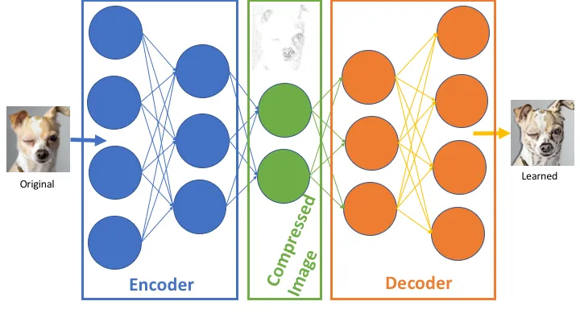
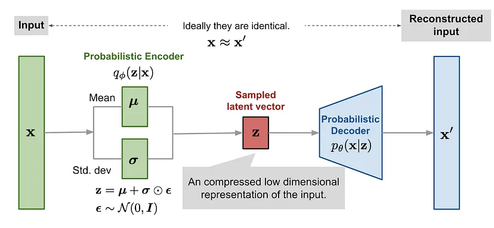
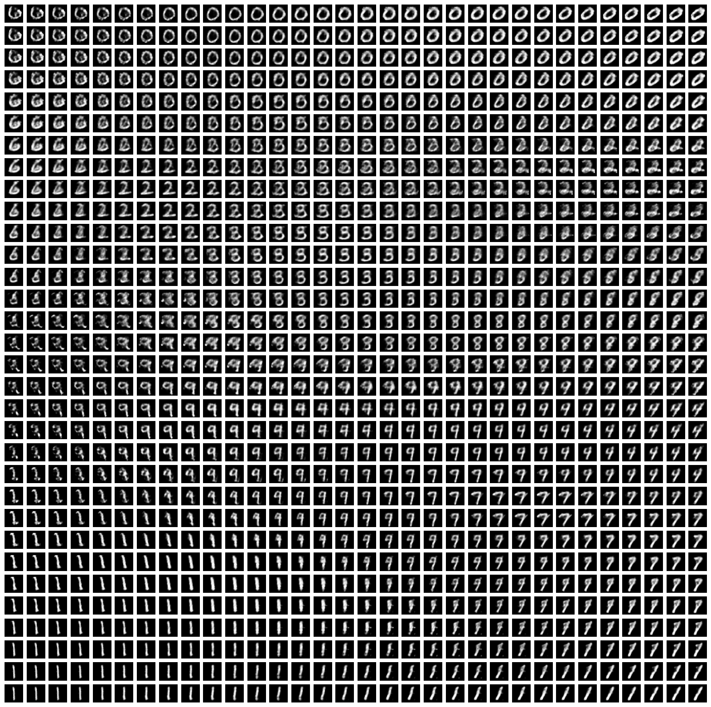
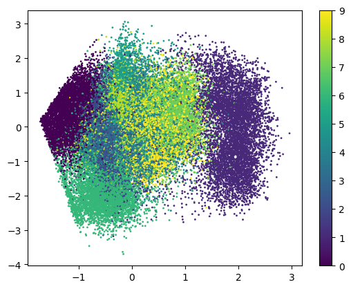
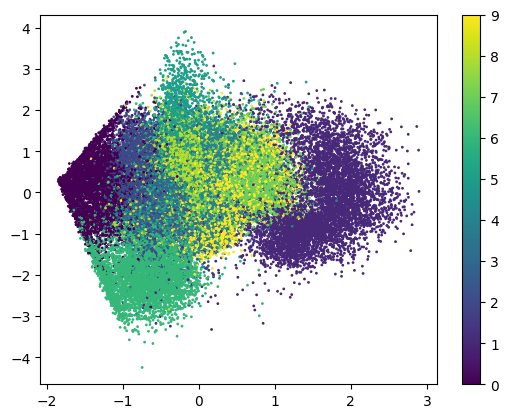

### **Auto Encoders**
Auto Encoders are kind of neural network or deep learning models which tries to compress the information hidded in one data to some less dimenssional vectors. There after the decoder of that architecture decodes the embedding/ encoded vectors into a similar object with similar information.

    

#### **Issues**
1. The encodings are static for an object encoded.
2. There is not relation between two objects in the latent space.
3. Traversal in the latent encoding space is not possible to use characteristics.

### **Variational Auto Encoder**
VAEs are special form of auto encoders where the encoding is not static/ strict but sampled from an latent space of normal distributions. Therefore there are many semantic relation between two points in the latent space.

* **Steps**
1. Encode the object and give the mean and variance in the latent space.
2. Sample a random point in that distribution (for which the mean and variance is predicted).
3. Reconstruct the object from that random point.

    

### **Loss Function**
Training of any ML model is based on some loss/ cost function. For VAEs the cost function is consists of two main components.
1. Reconstruction Loss
2. KL Divergence Loss

#### **Reconstruction Loss**
For reconstruction of digits, binary classification approach is taken therefore Binary Crossentropy or Log Loss is used as reconstruction is used. This loss is used when the model tried to predict between 0 and 1.

#### **KL Divergence**
This function can calculate the closeness of two probability distributions. KL Divergence helps out model to learn the underlying distributions and correct the position of the encodings in the latent space.

#### **Combined Loss**
The combined VAE Loss function is an weighted average of the lossses mentioned above. The weight of KL-Divergence is directly related to the spread and clear clusters of the digits. But is given too much importance then the smooth transition from one to another digit in latent space can be lost due to very much separated clusters.

### **Digits in Latent Space**

The digits in latent space as generated by the model is depicted below.

    

<h3>
Cluster After 100 Epoch
</h3>
    

<h3>
Cluster After 130 Epoch
</h3>
    

